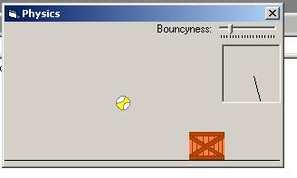



## \[Physics\]

### Description

I made this off the top of my head without any outside help whatsoever. Its pretty d@mn good considering I have an F in math.. Download it and see what you think and if you like it please vote! If you have any bugs please tell me and Ill try to fix them. Thx
 
### More Info
 

             |
---                |---
**Submitted On**   |2004-11-23 15:49:02
**By**             |[x sAGE x](https://github.com/Planet-Source-Code/PSCIndex/blob/master/ByAuthor/x-sage-x.md)
**Level**          |Intermediate
**User Rating**    |4.3 (26 globes from 6 users)
**Compatibility**  |VB 6\.0
**Category**       |[Miscellaneous](https://github.com/Planet-Source-Code/PSCIndex/blob/master/ByCategory/miscellaneous__1-1.md)
**World**          |[Visual Basic](https://github.com/Planet-Source-Code/PSCIndex/blob/master/ByWorld/visual-basic.md)
**Archive File**   |[\[Physics\]18213711242004\.zip](https://github.com/Planet-Source-Code/x-sage-x-physics__1-57396/archive/master.zip)

